# ai-o11y-demo-apps

> **A real, running AI product stack — instrumented end-to-end — so you can see what AI observability actually looks like.**


Two production-shaped AI applications (NeonCart e-commerce + SupportBot internal helpdesk) deploy to any Kubernetes cluster in one command. Realistic synthetic traffic runs 24/7. Full OpenTelemetry — metrics, logs, traces, plus Sigil generation events — ships directly to your Grafana Cloud. Within ~10 minutes you have a populated AI Observability dashboard, a live Sigil conversation explorer, and a per-agent ROI ratio telling you which AI agents pay for themselves.

---

## Quick start

```bash
git clone https://github.com/stephenwagner-grafana/ai-o11y-demo-apps
cd ai-o11y-demo-apps
pip install -r tools/requirements.txt
./tools/install.sh           # interactive — prompts for Claude key + Grafana Cloud creds
./tools/verify.sh            # 9 checks, all green
```

Port-forward to reach the UIs (or set `ingress.enabled=true` in your values):

```bash
kubectl -n neoncart    port-forward svc/neoncart-web    8080:8000  # http://localhost:8080
kubectl -n support-bot port-forward svc/supportbot-web 8081:8000  # http://localhost:8081
```

**Prereqs:** Kubernetes cluster (k3s, EKS, GKE, kind), `kubectl` + `helm` + `python3.10+` on PATH, an Anthropic API key, and a Grafana Cloud org with the Sigil plugin enabled.

> **Default StorageClass required.** Postgres requests a PersistentVolumeClaim with no explicit `storageClassName`, so it binds to the cluster's *default* StorageClass. If your cluster has none, the `data-postgres-0` PVC stays `Pending` with *"no persistent volumes available for this claim and no storage class is set"* and Postgres never starts. Check with `kubectl get storageclass` — exactly one should be marked `(default)`. Either mark one as default (`kubectl patch storageclass <name> -p '{"metadata":{"annotations":{"storageclass.kubernetes.io/is-default-class":"true"}}}'`) or set `postgres.storage.storageClass` in your values.

---

## What you get

- **NeonCart** — public cyberpunk e-commerce site with an AI chatbot + AI gift-finder, real Postgres catalog, and a signature *"show me mice"* trace that cascades a Postgres error through 5 spans for the demo "spot the bug" moment.
- **SupportBot** — internal "Ask Acme" helpdesk with an LLM-driven router that delegates to 3 domain specialists (billing / tech-support / account-management).
- **LLM gateway** — fans out to Anthropic (required) + optional OpenAI / Gemini / Ollama. Per-conversation sticky model routing, per-provider budget caps, cost computed per call, `/open` endpoint for self-throttling clients.
- **k6 loadgen** — ~140 distinct prompts, multi-turn flows, role-coherent SupportBot journeys, randomized **anomaly bursts** (runaway loops + token gluttons) for per-user anomaly stories. Self-throttles when caps close.
- **Two-tier routing** — synthetic loadgen traffic is gated by caps; real humans in the browser always get Claude, ungated. The browser demo never stalls because loadgen burned through the budget.
- **Full OTel** — every metric, log, trace, and generation event ships OTLP-direct to Grafana Cloud. No bundled collector. Custom `neoncart_*` / `loadgen_*` counters ride the same pipeline.

---

## Architecture

```mermaid
flowchart LR
  LG["k6 loadgen"]
  USR["real user"]

  subgraph apps["AI apps"]
    direction TB
    NCW["neoncart-web"]
    SBW["supportbot-web"]
  end

  subgraph spec["AI specialists"]
    direction TB
    NCB["nc-chatbot"]
    NCG["nc-gift-finder"]
    SBR["sb-router"]
    SBB["sb-billing"]
    SBT["sb-tech-support"]
    SBA["sb-account-management"]
  end

  subgraph back["Backends"]
    direction TB
    GW["llm-gateway"]
    PG["postgres"]
  end

  LG --> NCW
  LG --> SBW
  USR --> NCW
  USR --> SBW

  NCW --> NCB
  NCW --> NCG
  NCW --> PG

  SBW --> SBR
  SBR --> SBB
  SBR --> SBT
  SBR --> SBA

  NCB --> GW
  NCG --> GW
  SBR --> GW
  SBB --> GW
  SBT --> GW
  SBA --> GW

  NCB --> PG
  NCG --> PG
```



5 namespaces, ~10 pods. Single Helm chart. All telemetry pushes directly to Grafana Cloud — override the OTLP endpoint env var if your customer has Alloy in the path.

---

## Companion dashboards

Six portable Grafana dashboards live in [`dashboards/`](./dashboards). Import via **Grafana → Dashboards → New → Import**, or bulk-import with `bash dashboards/import.sh`.

| File | What it tells you |
|---|---|
| [`use-cases.json`](./dashboards/use-cases.json) | **Headline dashboard** — 38 panels: cost-per-model, ATC-per-model, agent ROI, per-employee token usage, tool calls, latency p50/p95/p99. Start here. |
| [`neoncart-business.json`](./dashboards/neoncart-business.json) | NeonCart business impact + AI conversion lift + per-agent ROI + eval quality at a glance. |
| [`cost-per-model.json`](./dashboards/cost-per-model.json) | Per-model cost & throughput leaderboard with gradient gauge cells. |
| [`ai-eval-results-full-breakdown.json`](./dashboards/ai-eval-results-full-breakdown.json) | Sigil eval pass-rate / fail-rate across agents, models, and evaluators. |
| [`problem-employees.json`](./dashboards/problem-employees.json) | Per-user anomaly catch + **🏆 AI champions** + **Wasted $$** composite — surfaces runaway loops and token gluttons against the rest of the fleet. |
| [`neoncart-ai-rca-conversation.json`](./dashboards/neoncart-ai-rca-conversation.json) | Single-conversation RCA — the dashboard the chatbot's "Investigate this issue" button deep-links to. |

Each JSON pins datasource UID to `grafanacloud-prom` so import doesn't prompt for remapping. Set up dashboards **after** install (~10 min for main models to warm; 30-60 min for rarer Anthropic models like Opus 4.7).

---

## Documentation

- [`CLAUDE.md`](./CLAUDE.md) — operator handoff: install commands, locked decisions, by-design oddities (read first before structural changes)
- [`docs/METRICS.md`](./docs/METRICS.md) — every metric, log field, span attribute, label
- [`docs/LOADGEN.md`](./docs/LOADGEN.md) — synthetic user behaviors, journey weights, anomaly bursts, throttle response
- [`docs/SIGIL_INTEGRATION.md`](./docs/SIGIL_INTEGRATION.md) — Sigil SDK setup, provider wrappers, OTel init order
- [`docs/EVALS.md`](./docs/EVALS.md) — 8 recommended Sigil evaluators with LLM-judge prompts
- [`helm/values.yaml`](./helm/values.yaml) — full chart configuration reference

---

## License

MIT — see [LICENSE](./LICENSE).
